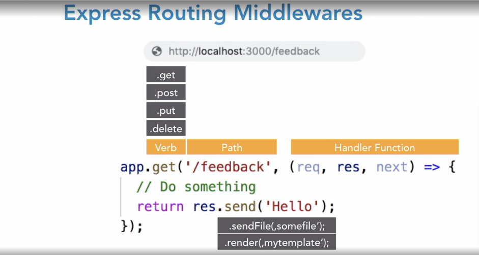
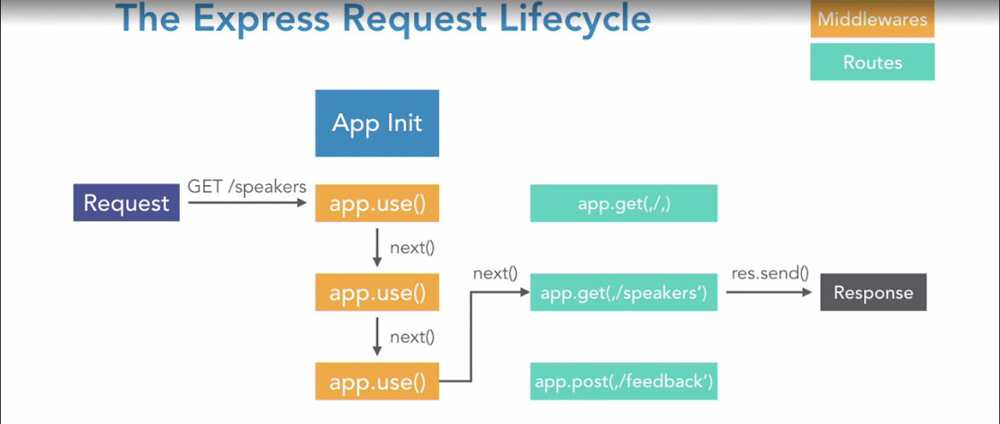

# Building a website with Node.js and Express

This repository contains the code for my course 'Building a Website with Node.js Node.js' on [LinkedIn Learning](https://www.linkedin.com/learning/building-a-website-with-node-js-and-express-js-3).

The master branch contains the initial version to get started with, while the branches contain the state of the code at the beginning (e.g. 02_02**b**) and end (e.g. 02_02**e**) of a video.

## Setting up the project

- In your terminal, create directory `building-website-nodejs-express` and **change into it**.
- Run
  ```bash
  git clone --bare git@github.com:danielkhan/building-website-nodejs-express.git .git
  git config --bool core.bare false
  git reset --hard
  git branch
  ```

Everything else will be discussed in my course.

## Uso básico

```js
const express = require('express');

const path = require('path');

const app = express();
const port = 3000;

app.use(express.static(path.join(__dirname, 'static')));

app.get('/', (req, res) => {
  res.sendFile(path.join(__dirname, '/static/index.html'));
});

app.get('/speakers', (req, res) => {
  res.sendFile(path.join(__dirname, '/static/speakers.html'));
});

app.listen(port, () => {
  console.log(`Ouvindo na porta ${port}!`);
});
```

### Configuração ESLint e Prettier

1. Instalar os packages:
   - eslint
   - prettier
   - eslint-config-prettier
   - eslint-plugin-prettier
2. Configurar o arquivo .eslintrc
   1. Adicionar ao extends e plugins o prettier
3. Configurar o arquivo .prettierrc
4. Caso não tenha no VS Code - O plugin ESlint
5. Caso não tenha no VS Code - O plugin Prettier
6. Configurar o workspace:
   ```json
   "eslint.format.enable": true,
   	"editor.formatOnSave": true,
   	"editor.defaultFormatter": "esbenp.prettier-vscode",
   	"editor.codeActionsOnSave":{
   		"source.fixAll": true
   	}
   ```

### Configuração do Code spell checker

1. Instale a extensão code spell checker
2. Instale a versão em português Portuguese code spell checker
3. Adicione nas configurações do Code spell checker o português como idioma válido

### Template Engines

Permite o reúso de códigos html com includes, interpolação entre outras features.

[Link dos template engines disponíveis](https://expressjs.com/en/resources/template-engines.html)

### Middleware

**Sintaxe**

- app.use(callback)
- app.use(path, callback);
- app.use([get | post | put | delete | ...](path, callback));

**Habilidades**

- Executar qualquer código
- Mudar os objetos request e response
- Finalizar o ciclo request-response normalmente enviado dados ao invocador
- Invocar o próximo middleware no stack

**Exemplos**

```js
app.use((req, res, next) => {
  // Faça algo
  return next();
});

// Com rota
app.use('/feedback', (req, res, next) => {
  // Faça algo
  return res.send('Hello, World!');
});
```



**Parâmetros para Routes**

```js
app.get('/speakers/:speakername', handler);

// Atende: /speakers/rainha
// Atende: /speakers/chuchu

app.get('/speakers/:speakername?', handler);

// Atende: /speakers/
// Atende: /speakers/chuchu
```


